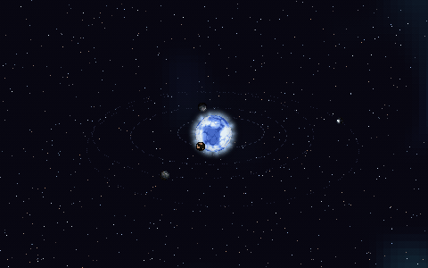

# solar



A draggable, zoomable **solar system**: a central star with worlds in eccentric
orbit, against a parallax starfield, rendered into an arbitrary viewport. Same
seed, same system, forever.

```bash
cargo run --release -p solar --bin solar    # orbit + pan GIFs, posters, into out/
cargo run --release -p solar --bin bench    # frame decomposition

cargo build -p solar --target wasm32-unknown-unknown --release --no-default-features
cp target/wasm32-unknown-unknown/release/solar.wasm crates/solar/web/solar.wasm
cd crates/solar/web && python3 -m http.server 8000
```

Drag to pan · scroll / pinch to zoom · tap a planet to follow it.

## What is actually new here

The worlds in orbit are **literally the `planet` demo's worlds** — same archetype
table, same shader — asked for in [`planet-core`](../planet-core/README.md)'s
*sprite* framing: a transparent tile, sized to its disc and lit from an arbitrary
direction. The star is [`sun-core`](../sun-core/README.md)'s tile and the sky is
[`background-core`](../background-core/README.md). So the new work is the layer on
top:

- **Orbital layout** — from a seed: a star (1 of 5 archetypes), then 4–8 planets
  placed outward in bands, so rocky and lava worlds fall near the star and gas and
  ice giants far out. Speeds are Keplerian-ish — inner planets sweep faster.
- **Eccentric orbits** — each planet travels a Kepler ellipse with the star at a
  focus, solved from the mean anomaly, so worlds speed up at perihelion. The
  **Eccentricity** slider scales the whole system from circular (0) through as
  generated (1) to exaggerated (2).
- **Sun-lit phases** — each planet is lit from the star's *screen* direction, so
  worlds show crescent → gibbous phases depending on where they are in orbit.
- **Depth sorting** — planets are drawn back-to-front by orbital depth, so one on
  the far side is occluded by the sun and one on the near side passes in front.
- **Click to follow** — click a planet and the camera locks on and tracks it around
  its orbit; drag anywhere to release.

Each frame: paint the background, dot in each orbit path, render every body to a
small RGBA tile and alpha-blend it in, depth-sorted.

**Add a world** = a row in `ROSTER` (`src/lib.rs`) naming a `planet-core` type and
the orbital band it belongs in — the archetype itself is defined once, over in
`planet-core`. **Add a star** = a row in `SUNS`, same file. Both refer to types **by
string**, and a typo silently falls back to type 0, so this crate's tests exist to
catch exactly that. Keep them passing.

## Controls

Zoom reveals detail rather than magnifying fixed pixels: the render buffer is sized
so a rendered pixel is a constant on-screen block at every zoom, while bodies render
at a resolution that grows as you zoom in. A **Controls** dock exposes manual
overrides:

- **Layout** — planet count, planet spacing, planet size, sun size, orbit thickness
  (dashed-path line weight), eccentricity.
- **Motion** — orbit speed, and separate **planet** and **star rotation** speeds
  (three independent clocks; each accumulates, so changing a speed never jumps).
- **Pixelation** — scene / planet / sun pixel size, plus per-body **detail caps**
  (planets and sun separately): the lower bound of pixelation — how far you can
  zoom before a body stops resolving finer and just enlarges its blocks. Lower caps
  also keep zoomed-in views cheap.
- **Background** — star density (constant across zoom) and star parallax
  (scroll-rate multiplier: 0 pins the stars on pan, higher makes them feel closer).

Sizes, spacing, pixelation and detail caps are live view params applied with
`system_set_view` and no regeneration; only seed and planet count rebuild the
system. Works on touch. `node crates/solar/web/verify.mjs` renders the system
headlessly as a build check.

## The performance readout

Top-right, click to collapse, **P** to hide. Shows smoothed **FPS**, the **render
time**, the whole-frame time, that render as a **percent of a 60 fps budget** (with
a green→amber→red bar), the current render resolution, and whether the **backdrop
was cached or redrawn** this frame — so you can watch it flip to "cached ✓" the
instant you stop dragging.

Under WebGL2 it adds the adapter name, draw counts, and where the browser allows it
the real GPU time per frame:

```
36 fps · 1.1 ms render
submit 1.1 ms (GPU runs async)
backdrop: no cache needed
GPU Apple M2 · gpu 2.31 ms · 14% of a 60 fps slot
draw 5 bodies · 2410 stars · 436 orbit
```

Three things there are deliberate:

- `render` is relabelled **submit**, because the draw calls return long before the
  GPU has finished them — timing them and calling it CPU load would flatter the
  path.
- GPU time comes from `EXT_disjoint_timer_query_webgl2`, read a few frames late so
  asking never stalls the pipeline. Chrome exposes it, Firefox removed it, Safari
  never shipped it, so its absence is normal and the HUD says so. It is
  sanity-checked against the frame interval before it is believed — a frame cannot
  spend more GPU time than the wall clock between frames, and SwiftShader here
  reports ~750 ms against 50 ms frames. That matters beyond the display, because
  auto-detail paces off the number.
- A **software rasterizer is called out in amber.** `gl.RENDERER` is masked to
  something generic by every modern browser, so the real name needs
  `WEBGL_debug_renderer_info` — and a browser that has quietly fallen back to
  SwiftShader or llvmpipe is running this path with none of its advantages, which
  is the single most useful thing the HUD can tell you when the GPU renderer is
  somehow *slower* than the CPU one.

There is no WebGL API for GPU *utilization* or VRAM — browsers do not expose
either. GPU milliseconds against the vsync slot is the honest version of the same
question.

## Profiling

`cargo run -p solar --release --bin bench` decomposes a frame by rendering the same
scene under controlled scenarios: bodies culled off-screen (background only),
density 0 (no stars), zoomed past the nebula fade (base fill only). At 1000×640,
seed 7 (4 planets), native, before and after the caching:

| scenario | before | after |
|---|---|---|
| fit view, panning (drag) | ~17 ms · 58 fps | **~4 ms · 240 fps** |
| fit view, still camera | ~17 ms · 58 fps | **~2.6 ms · 385 fps** |
| zoomed onto the sun | ~39 ms · 26 fps | **~8 ms · 125 fps** |
| zoomed onto a planet | ~35 ms · 29 fps | ~34 ms · 30 fps |

The background half of that is `BackdropCache`
([background-core](../background-core/README.md)); `render_system_cached` is this
crate's layer on top, which also caches the orbit paths, so a still camera makes the
whole backdrop one `memcpy`. The star half is `SunCache`
([sun-core](../sun-core/README.md)); the zoomed-in planet is
[planet-core](../planet-core/README.md#zoomed-in).

**Timing a scene means putting the body on screen.** Two ways to get this wrong,
both of which produce a confident number: a camera parked where a planet started
drifts off it within a few frames and then you are timing the backdrop (this bench
once printed 0.28 ms for a scenario whose real cost is 40 ms), and a camera that
jumps far each frame re-bakes the nebula and buries the body under it. Use
`ms_follow` as the template.

## On the GPU

`solar` renders in three passes — one fullscreen triangle for the backdrop, the
dashed orbit paths as point sprites, then one quad per body back-to-front with
alpha blending, which *is* the painter's algorithm `blit` was implementing by hand.

**A GPU scene is a draw list, not pixels.** `gl_bodies()` emits one record per body
— the destination rect from `dest_rect`, then that shader's uniform block — sorted
back-to-front, and every number in it comes from the same expressions `draw_bodies`
uses (`Planet::at`, `to_screen`, the detail caps, the sunward light).

Everything the CPU path had to cache is simply absent:

| CPU | GPU |
|---|---|
| `BackdropCache` — a scrolling sprite memmoved on a pan | one triangle; a camera that follows a body costs the same as a still one |
| `SunCache` + a quantized boil clock | no bake, so `t_sun` passes straight through and the convection stops stepping |
| `visible_tile_rect`, hand-arranging which tile pixels get shaded | the rasterizer clips the quad |
| ~32 MB/frame of copies: band slices, worker transfers, `putImageData` | nothing is read back |

Do not port those caches back without a measurement — dropping them is most of the
win.

The per-body pixelation knobs still work, exactly: the fragment shader maps its
destination pixel back through the *same* expression `blit` uses, so a body is
blocky in the places `planet_pixel` and the detail cap make it blocky, with no
second render target. Change one, change both.

```bash
node scripts/verify-gl.mjs --demo solar --size 240
```

diffs whole scenes at three zooms (fit, mid, zoomed onto a body) and lands at
**0.00%** of pixels differing by more than a quantization level. Its raw
disagreement rate is 17–30% and that is the nebula, not the bodies — see
[background-core](../background-core/README.md#scatter-dont-gather).

**Known divergence: the orbit dots.** `paint_orbit` adds to a *ceiling* (26→90,
30→96, 40→120), so a dot crossing a bright star DARKENS it; the GPU's
`blendFunc(ONE, ONE)` saturates at 255 instead. 62–1025 px/frame hit that ceiling at
seeds 7 and 21 — real, ~0.04% of pixels, under `verify-gl`'s rate gate. Unfixed.
Reproduce by counting pixels at exactly `(90, 96, 120)`.

## Hand-synced name arrays

The C ABI cannot return strings, so `ROSTER` is mirrored in `web/index.html`,
`web/verify.mjs` **and** `scripts/verify-gl.mjs`. Nothing checks the lengths agree.
Reorder the roster and `grep` for the array by name.
